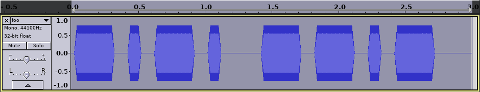

# PyCWgen

Generate Morse code (CW, continuous wave) audio files from Python.

## Features

- Read text input from file, stdin or on the command line
- Variable tone frequency and word speed
- Output 16bit audio at 44.1kHz
- Output formats: mp3, ogg, wav, raw pcm

The generated audio is a sine wave, with a 20 ms attack / release
angle to make it sound better to the ear.




## Usage

```
usage: pycwgen.py [-h] [--input INPUT_FILE] [--text INPUT_TEXT]
                  [--speed SPEED] [--tone TONE] [--output OUTPUT_FILE]
                  [--format {pcm,wav,mp3,ogg}]

Generate morse code audio files

optional arguments:
  -h, --help            show this help message and exit
  --input INPUT_FILE, -i INPUT_FILE
                        Input text file (default: stdin)
  --text INPUT_TEXT, -t INPUT_TEXT
                        Input text (directly on the command line)
  --speed SPEED, -s SPEED
                        Speed, in words per minute (default: 12)
  --tone TONE           Tone frequency. Defaults to 800 Hz.
  --output OUTPUT_FILE, -o OUTPUT_FILE
                        Output file name. Defaults to standard output.
  --format {pcm,wav,mp3,ogg}, -f {pcm,wav,mp3,ogg}
                        Output file format. Supported: wav, pcm, mp3, ogg. If
                        omitted, will be guessed from file extension.
```
