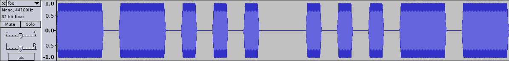
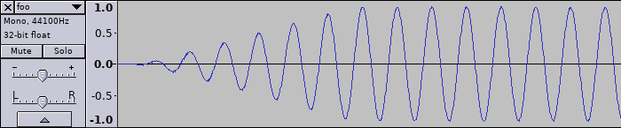

# PyCWgen

Generate Morse code (CW, continuous wave) audio files from Python.



## Features

- Read text input from file, standard input or on the command line
- Set word speed and tone frequency
- Output single-channel audio at 44.1kHz, via sndfile
- Supports multiple output formats (including PCM, WAV, OGG)

Smooth attack and release angles, to reduce sound harshness:




## Planned features

- Background noise (allow setting signal-to-noise ratio)
- Band-pass filtering (to make it sound more natural, filter the background noise)
- Imprecise keying (slightly vary the symbol speed, to simulate someone using a straight key)
- Distort tone
- Simulate QSB (randomly fade the signal level)
- Simulate QRM? (add "interfering" transmissions on nearby frequencies)


## Usage

```
Usage: pycwgen [OPTIONS]

Options:
  -i, --input FILENAME  Input text file (defaults to stdin)
  -t, --text TEXT       Input text. Overrides --input.
  -s, --speed INTEGER   Speed, in words per minute (default: 12)
  --tone INTEGER        Tone frequency, in Hz (default: 600)
  -o, --output PATH     Name of the output file
  -f, --format TEXT     Output format. Use --list-formats to see the available
                        formats
  --subtype TEXT        Output format sub-type
  --list-formats        List the available formats and exit
  --list-subtypes TEXT  List the available sub-types for the specified format
                        and exit
  --help                Show this message and exit.
```


## Supported audio formats

Supports all the output formats suported by libsndfile, including:
AIFF, FLAC, OGG, RAW, WAVEX, WAV.
Unfortunately mp3 is not supported for legal reasons, and WebM support
is work in progress.

In the meantime, you can simply convert the audio using ffmpeg, for
example:

```
ffmpeg -i input.ogg output.mp3
```

In case you need to convert RAW PCM data (without headers), you can
use something like this:

```
ffmpeg -f s16le -ar 44.1k -ac 1 -i input.pcm -f mp3 output.mp3
```

**Note:** make sure you select an appropriate format matching the
pycwgen output format you chose. In this case, 16-bit signed integers,
using little endian encoding.
